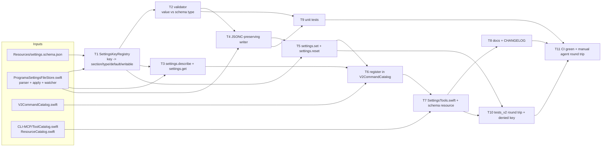

# Settings read/write over the socket and MCP

Status: planned, 2026-09-02.
Scope: `settings.describe` / `settings.get` / `settings.set` socket methods, the matching
`programa-mcp` tools and a schema resource, docs, and tests. No UI work.
Follow-up to `docs/plans/mcp-server.md`.

## Correction to the briefing

`docs/programa-json.md` documents `programa.json`, the command-palette file
(`docs/programa-json.md:1-12`). It is not the reference for `settings.json`. No user-facing
document for `settings.json` exists today — only incidental mentions in
`docs/terminal-themes.md` and `docs/keyboard-shortcuts.md`. Task 8 therefore creates
`docs/settings-json.md` rather than editing `docs/programa-json.md`.

## Goal and non-goals

An agent running inside Programa should be able to read the app's current settings, learn the
legal shape of every key from the shipped schema, and change keys deliberately. Today
`Resources/settings.schema.json` is the contract but nothing serves it over the socket, and
`ProgramaSettingsFileStore` is read-only — its single write is the commented-out bootstrap
template (`Sources/ProgramaSettingsFileStore.swift:223-244`). An agent that wants to retune the
terminal has to guess key names and hand-edit the file, which is exactly the failure mode this
plan removes.

Non-goals: no Settings-window changes, no new preference keys, no shortcut rebinding through
these methods beyond what `shortcuts.bindings` already accepts, no remote-daemon surface, no
`browser.*` expansion. The plan also does not unify the two writers of the sidebar tint defaults
described at `Sources/ProgramaSettingsFileStore.swift:1000-1010`; that conflict is pre-existing
and stays documented rather than fixed here.

## Functional DAG



Parallel batches read off the columns: T1 alone; then T2 and T3 together; then T4; then T5;
then T6; then T7; then T8, T9 and T10 together; then T11.

## 1. Command design

All three methods live in a new `Sources/TerminalController+Settings.swift`, dispatched from the
switch in `Sources/TerminalController.swift:1943` and listed in `Sources/V2CommandCatalog.swift`
next to `settings.open` (line 60). None of them touch AppKit, so per the CLAUDE.md threading
policy they run entirely off-main — no `v2MainSync`, unlike `app.reload_config`
(`Sources/TerminalController+System.swift:519-527`).

**`settings.describe`** — no params, or `{"section": "app"}`. Returns one entry per known key:

```json
{"keys": [{"path": "app.appearance", "section": "app", "type": "string",
           "enum": ["system", "light", "dark"], "default": "system",
           "description": "App appearance mode.", "value": "dark",
           "source": "file", "writable": true}],
 "settings_path": "/Users/x/.config/programa/settings.json", "schema_version": 1}
```

`source` is `file` when the key appears in the active settings file, `defaults` when the effective
value comes from `UserDefaults` (a Settings-window edit), and `builtin` when neither wrote it and
the schema default applies. The store already distinguishes the first case: a key present in the
file lands in `managedUserDefaults` or `managedCustomSettings`
(`Sources/ProgramaSettingsFileStore.swift:333-371`), and `applyManagedSettings` records a backup
of the pre-file value under the same identifier set (lines 1011-1073). Expose that distinction
through two new read accessors on the store rather than re-parsing the file in the handler.

**`settings.get`** — `{"path": "app.appearance"}` or `{"section": "browser"}`. Returns the same
entry shape as `describe`, minus `description` and `enum`, for one key or one section. Exactly one
of `path`/`section` is required; both or neither is `invalid_params`, matching the strictness
`tests_v2/test_jsonrpc_strict_param_validation.py` already enforces for other methods.

**`settings.set`** — `{"values": {"app.appearance": "dark", "app.terminalOpacity": 0.9}}`.
Dotted paths, so `browser.proxy.port` addresses a nested key. A JSON `null` means "remove
Programa's managed override", which is what the parser already treats `NSNull` as for the
nullable keys (`Sources/ProgramaSettingsFileStore.swift:410-466`). The whole batch is validated
before anything is written; one bad key fails the batch with nothing changed. Response echoes
each path with its `previous` and `value`, plus `"applied": true` once the store has reloaded.

**`settings.reset`** — worth shipping in v1, as `{"paths": [...]}` only. It is a thin alias for
`settings.set` with `null` for file-managed keys, and it is the only way an agent can undo its own
change without knowing what the value was before. A whole-file reset is not in v1: it would
discard user edits the agent never made.

Error codes reuse the existing vocabulary. Unknown path or wrong value type is `invalid_params`
with `data: {"path": ...}`. A key on the deny list is `not_supported` with
`data: {"path": ..., "reason": "agent_writable_denied"}`, the same code used for capability
refusals elsewhere (`Sources/TerminalController+Surface.swift:945`). A settings file that fails to
parse is `invalid_state` — the writer must never overwrite a file it could not read.

File-only versus UserDefaults-only keys: every key in the schema is file-settable by definition,
so `settings.set` has no split. The split appears in `describe`'s `source` field and in the
`writable` flag. Keys that exist in `UserDefaults` but have no schema entry are not addressable at
all; the schema is the contract, and adding a key means adding it to the schema first.

## 2. Write path decision

**Recommendation: write the settings file and reload the store synchronously (option a).**

Writing `UserDefaults` directly (option b) loses on the next reload: `applyManagedSettings`
re-asserts every file-managed key over `UserDefaults` and restores backups for keys that left the
file (`Sources/ProgramaSettingsFileStore.swift:1029-1067`). An agent's direct defaults write would
survive only until the next file touch, and would leave no backup entry, so a later removal would
restore the wrong prior value. Option (c), file plus an explicit `app.reload_config`, makes the
agent do two calls to get a consistent read and leaves a window where `settings.get` reports the
old value.

Concretely: `settings.set` splices the new values into the file, then calls the store's `reload()`
(line 156) inline and returns the re-read effective values. The watcher
(`Sources/ProgramaSettingsFileStore.swift:111-122`) will also fire, but `reload()` is idempotent
and serialized on `managedSettingsQueue`, so the duplicate is harmless and the response is never a
guess. The Settings window reflects the change through the same path a manual file edit already
uses: `applyManagedSettings` writes `UserDefaults`, and the `@AppStorage` bindings update.

Concurrent user edits: read the file, compute the splice, and write with
`Data.write(options: .atomic)` plus `0o600`, mirroring the bootstrap writer
(`Sources/ProgramaSettingsFileStore.swift:239-240`). Take the file's modification date before the
read and re-stat before the write; if it moved, fail with `invalid_state` and
`data: {"reason": "file_changed"}` rather than clobbering. This is last-writer-wins avoidance, not
locking, and that is the right level for a config file a human edits by hand.

Comments: a naive read-modify-write would destroy the file. `JSONCParser.preprocess` strips
comments before `JSONSerialization` (`Sources/ProgramaSettingsFileStore.swift:321-322`), and the
bootstrap template is *entirely* commented-out keys (lines 1499-1523), so re-serializing a
freshly bootstrapped file would delete every hint the user has. The writer therefore edits text,
not a decoded object: locate the target key's value span in the raw string and splice. When the
key is absent it is inserted at the end of its section, and when the section is absent the section
is appended before the closing brace. Comments and unknown keys outside the spliced span are
untouched by construction.

## 3. Permission model

There is no per-command permission tier in the socket layer today. Access is decided once per
connection from `accessMode` and the optional password (`Sources/TerminalController.swift:443-508`,
modes at `Sources/SocketControlSettings.swift:7-61`), and the only per-method classification that
exists is the focus-intent allowlist `focusIntentV2Methods`
(`Sources/TerminalController.swift:570-574`). Inventing a second tier for one method family would
add a security-relevant concept with one user.

So: reads and writes both sit at the existing connection gate, and none of the three methods joins
`focusIntentV2Methods` — changing a setting must never move the user's focus. The real protection
is a deny list, expressed as an `agentWritable: Bool` on each `SettingsKeyRegistry` entry (task 1)
and surfaced in `describe` so an agent learns the boundary instead of discovering it by error.

Deny (`agentWritable: false`), because each widens the agent's own authority:

| Path | Why |
|---|---|
| `automation.socketPassword` | Writes the credential file that gates the socket (`Sources/SocketControlSettings.swift:177-201`). |
| `automation.socketControlMode` | Sets the gate itself, up to `allowAll`. |
| `automation.claudeBinaryPath` | Chooses a binary the app then launches. |
| `customCommands.trustedDirectories` | Turns untrusted `programa.json` commands into auto-run ones. |
| `browser.insecureHttpHostsAllowedInEmbeddedBrowser`, `browser.proxy` | Downgrade transport security for the embedded browser. |

Everything else in the schema is writable, including appearance, fonts, opacity, blur, workspace
colors, notification settings, and shortcut bindings. The deny check runs during batch validation,
before any file read, so a batch containing one denied path changes nothing.

## 4. MCP surface

Add `CLI-MCP/Tools/SettingsTools.swift` with three `ProgramaTool` entries built the same way as
`SystemTools` (`CLI-MCP/Tools/SystemTools.swift:6-38`), appended to `ToolCatalog.all`
(`CLI-MCP/ToolCatalog.swift:176-187`). Names: `settings_describe`, `settings_get`, `settings_set`,
plus `settings_reset`. None is focus-stealing, so none takes the `focus_` prefix. Update the
exclusion comment at `CLI-MCP/ToolCatalog.swift:161-175`, which currently lists `settings.open` as
excluded app chrome — that exclusion stands, but the comment must say why `settings.*` is now
partly included.

Resource: `programa://settings/schema`, a concrete resource in `ListResources`
(`CLI-MCP/ResourceCatalog.swift:22-31`) serving `Resources/settings.schema.json` as
`application/json`, and `programa://settings/current` backed by `settings.describe`. The `host`
switch in `ResourceCatalog.read` (line 59) gains a `"settings"` case with two path segments.
Serving the schema as a resource rather than a tool matters: an agent can pull it once into
context and then write valid values without a round trip per key.

Tool description shown to agents, one paragraph, on `settings_describe`:

> Lists every Programa setting with its section, type, default, current value, and where that
> value came from (the settings file, the Settings window, or the built-in default). Read this
> before changing anything, and read `programa://settings/schema` for the full JSON Schema
> including enums and ranges. Settings that would widen this agent's own authority are reported
> with `writable: false` and cannot be changed here.

## 5. Task DAG

| # | Task | Files | Est. |
|---|---|---|---|
| 1 | `SettingsKeyRegistry`: one entry per schema key with section, dotted path, type, default, enum, description, `agentWritable`. Generated from `Resources/settings.schema.json` at build time or hand-mirrored with a test that fails on drift. | `Sources/SettingsKeyRegistry.swift` (new, needs 4 pbxproj entries) | 4h |
| 2 | Value validator: path lookup, type and enum and range checks, `null` handling. | `Sources/SettingsKeyRegistry.swift` | 2h |
| 3 | `settings.describe` / `settings.get` handlers plus the two store accessors that expose file-managed versus defaults-managed provenance. | `Sources/TerminalController+Settings.swift` (new), `Sources/ProgramaSettingsFileStore.swift` | 4h |
| 4 | JSONC-preserving splice writer with atomic write, `0o600`, and mtime guard. | `Sources/ProgramaSettingsWriter.swift` (new) | 5h |
| 5 | `settings.set` and `settings.reset` handlers: batch validate, deny check, write, inline `reload()`, echo effective values. | `Sources/TerminalController+Settings.swift` | 3h |
| 6 | Register four methods in the catalog and the dispatch switch. | `Sources/V2CommandCatalog.swift`, `Sources/TerminalController.swift` | 1h |
| 7 | MCP tools and the two settings resources. | `CLI-MCP/Tools/SettingsTools.swift` (new), `CLI-MCP/ToolCatalog.swift`, `CLI-MCP/ResourceCatalog.swift` | 3h |
| 8 | Docs: new `docs/settings-json.md`, a settings section in `docs/mcp-server.md` (tables at lines 114-144), and a `SKILL.md` paragraph so an in-app agent knows the tools exist. Plus `CHANGELOG.md`. | `docs/settings-json.md`, `docs/mcp-server.md`, `SKILL.md`, `CHANGELOG.md` | 3h |
| 9 | Unit tests, see below. | `programaTests/` (new files, pbxproj entries) | 4h |
| 10 | `tests_v2` socket tests, see below. | `tests_v2/` | 3h |
| 11 | CI green, then a manual round trip from an agent inside a tagged build. | — | 1h |

Total 33h. What moves it: task 1 doubles if the registry is generated from the schema at build
time instead of hand-mirrored, and task 4 doubles if the splice writer has to handle nested
paths inside multi-line JSONC blocks such as `browser.proxy` (assume it does). Every new `.swift`
file needs four manual `project.pbxproj` entries or the build fails with "cannot find type in
scope"; build after each new file, not in a batch.

## 6. Tests

Unit (`programaTests/`, run in CI, never locally per the testing policy):

1. `SettingsKeyRegistryTests` — every schema key resolves; a key removed from the schema fails
   lookup; validator accepts and rejects representative values per type, including the boolean
   versus integer distinction the store's `jsonBool`/`jsonInt` already enforce
   (`Sources/ProgramaSettingsFileStore.swift:1468-1480`); denied paths report `agentWritable: false`.
2. `ProgramaSettingsWriterTests` — build a temp file from
   `ProgramaSettingsFileStore.defaultTemplate()`, splice a value, assert the comment lines survive
   verbatim and an unrelated unknown key survives; assert insertion into an absent section; assert
   the mtime guard rejects a file changed underneath; assert `0o600` on the result. Then construct
   a `ProgramaSettingsFileStore` against that temp path, exactly as
   `programaTests/WorkspaceUnitTests.swift:1424-1430` already does, and assert the written value
   reaches `UserDefaults` through the real reload path. This is behavior through the store, not a
   text assertion about source.
3. MCP tool wiring is verified over the wire, not in Swift — `CLI-MCP/ToolCatalog.swift` imports
   the MCP SDK, which `programaTests` deliberately does not link
   (`programaTests/MCPSocketBridgeTests.swift:14-23`). Bridge-level error mapping for the new
   `not_supported` deny response gets a case in `MCPSocketBridgeTests` using its existing mock
   listener.

Socket (`tests_v2/`, CI or a tagged build's socket only):

4. `tests_v2/test_settings_describe_get_set.py` — `describe` returns a known key with a `source`;
   `set` changes `app.appearance`, `get` reflects it, and a follow-up `set` restores the original
   so the test leaves no residue; `reset` on the same path clears the file entry.
5. `tests_v2/test_settings_denied_keys.py` — `set` on `automation.socketControlMode` returns
   `not_supported` and the effective mode is unchanged afterward; a batch mixing one allowed and
   one denied key changes neither.
6. Extend `tests_v2/test_mcp_server_e2e.py` so `tools/list` includes the four settings tools and
   `resources/list` includes `programa://settings/schema`.

## 7. Risks and open questions

1. **Registry drift from the schema.** The registry duplicates facts the schema already states.
   Default: hand-mirror it and add a test that walks `Resources/settings.schema.json` and fails on
   any key missing from the registry, so drift breaks CI rather than silently shipping.
2. **Splice writer on hand-mangled files.** Real files contain trailing commas, nested comments,
   and duplicate keys. Default: parse-check with `JSONCParser.preprocess` first, and refuse with
   `invalid_state` when the file does not round-trip; never rewrite a file the writer does not
   fully understand.
3. **Shortcut bindings through `settings.set`.** `shortcuts.bindings` is a free-form map validated
   by `KeyboardShortcutSettings.Action` (`Sources/ProgramaSettingsFileStore.swift:850-864`), not by
   the schema. Default: accept it, validate action names against `Action.allCases` and stroke
   syntax against the existing parser, and reject unknown actions as `invalid_params` rather than
   letting them be silently ignored the way file parsing does today.
4. **An agent locking itself out.** Even with the deny list, an agent could set
   `app.appearance` or a font that makes the app unusable to the user. Default: accept the risk,
   and rely on `settings.reset` plus the fact that every changed key leaves a visible line in a
   file the user already owns.
5. **`settings.reset` scope creep.** A full reset is the obvious next ask. Default: keep v1 to
   explicit paths and revisit only if someone asks, since a whole-file reset destroys user edits
   the agent never made.

## ADR-001: settings writes go through the settings file, not UserDefaults

**Status.** Proposed.

**Context.** `settings.set` has to land a value somewhere that survives, is visible to the user,
and reaches the Settings window. `ProgramaSettingsFileStore` treats the file as authoritative and
re-asserts it over `UserDefaults` on every reload.

**Options considered.** (A) Write the file and reload the store inline. (B) Write `UserDefaults`
directly. (C) Write the file and require a separate `app.reload_config`.

**Decision.** Option A. B is overwritten by the store's own apply path and leaves the backup map
inconsistent; C leaves a stale read window and doubles the agent's call count for no gain.

**Consequences.** A JSONC-preserving text writer is required, which is the largest single task in
this plan. The mtime guard makes concurrent hand-edits fail loudly instead of silently losing.
`settings.get` is consistent immediately after `settings.set` returns.

Plan complete. Delegate to implementer for execution.
